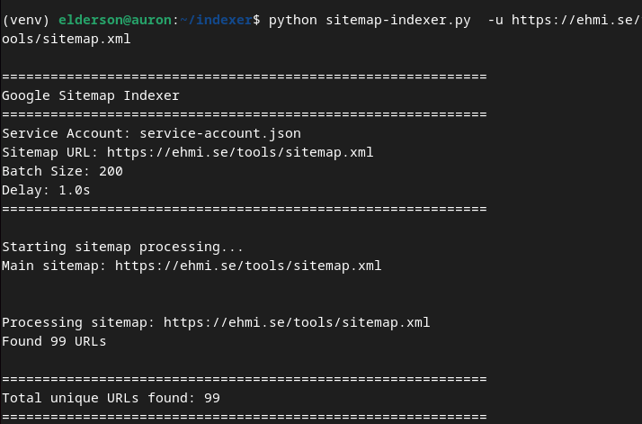

# Google Sitemap Indexer

Automatically extract URLs from XML sitemaps and submit them to Google Indexing API.



## Features

- Recursively crawls sitemap indexes and nested sitemaps
- Extracts all URLs from XML sitemaps
- Submits URLs to Google Indexing API for faster indexing
- Built-in rate limiting and error handling
- Progress tracking and detailed reporting

## Prerequisites

- Python 3.7+
- Google Cloud account
- Google Search Console access

## Installation

1. **Clone the repository**
```bash
git clone https://github.com/mrxehmad/google-search-console-indexer.git
cd google-search-console-indexer
```

2. **Install dependencies**
```bash
pip install -r requirements.txt
```

## Google Cloud Setup

### 1. Create a Google Cloud Project

- Go to [Google Cloud Console](https://console.cloud.google.com/)
- Click **Select a project** → **New Project**
- Enter a project name and click **Create**

### 2. Enable the Indexing API

- In your project, go to **APIs & Services** → **Library**
- Search for **"Web Search Indexing API"**
- Click on it and press **Enable**

### 3. Create Service Account

- Go to **APIs & Services** → **Credentials**
- Click **Create Credentials** → **Service Account**
- Fill in the name (e.g., `sitemap-indexer`) and click **Create**
- Skip optional steps and click **Done**

### 4. Download JSON Key

- Click on the service account you just created
- Go to the **Keys** tab
- Click **Add Key** → **Create new key**
- Choose **JSON** and click **Create**
- The file will download automatically
- Rename it to `service-account.json` and place it in the project root

### 5. Add Service Account to Search Console

**This step is critical!**

- Open your `service-account.json` file
- Copy the email address from the `client_email` field
- Go to [Google Search Console](https://search.google.com/search-console/)
- Select your property
- Click **Settings** → **Users and permissions** → **Add user**
- Paste the service account email
- Set permission level to **Owner**
- Click **Add**

## Configuration

Edit `sitemap-indexer.py` and update the path to your service account file:

```python
SERVICE_ACCOUNT_FILE = 'service-account.json'
```

You can also adjust:
- `BATCH_SIZE` - Max URLs to process (default: 200)
- `DELAY_SECONDS` - Delay between requests (default: 1.0)

## Usage

Basic usage:
```bash
python sitemap-indexer.py -u https://example.com/sitemap.xml
```

Process with custom batch size:
```bash
python sitemap-indexer.py -u https://example.com/sitemap.xml --batch 100
```

Add delay between requests:
```bash
python sitemap-indexer.py -u https://example.com/sitemap.xml --delay 2.0
```

View all options:
```bash
python sitemap-indexer.py --help
```

## Example Output

```
============================================================
Google Sitemap Indexer
============================================================
Service Account: service-account.json
Sitemap URL: https://example.com/sitemap.xml
Batch Size: 200
Delay: 1.0s
============================================================

Processing sitemap: https://example.com/sitemap.xml
Found 3 nested sitemaps

Processing sitemap: https://example.com/sitemap-posts.xml
Found 150 URLs

============================================================
Total unique URLs found: 185
============================================================

[1/185] ✓ Indexed: https://example.com/post-1
[2/185] ✓ Indexed: https://example.com/post-2
...

============================================================
Indexing Summary:
Total URLs: 185
Successfully indexed: 183
Failed: 2
============================================================
```

## Troubleshooting

**403 Forbidden / Permission Denied**
- Ensure service account email is added as **Owner** in Search Console (not just User)

**API Not Enabled**
- Go to Google Cloud Console and enable "Web Search Indexing API"

**File Not Found**
- Check the `SERVICE_ACCOUNT_FILE` path in the script

**Invalid Credentials**
- Re-download the service account JSON key from Google Cloud Console

## API Limits

- Default quota: **200 URLs per day**
- You can request quota increases in Google Cloud Console
- The Indexing API is primarily for job postings and livestream videos
- For general pages, regular sitemap submission is recommended

## License

MIT License - see LICENSE file for details

## Support

For issues and questions, please open an issue on GitHub or check [Google's Indexing API documentation](https://developers.google.com/search/apis/indexing-api/v3/quickstart).
